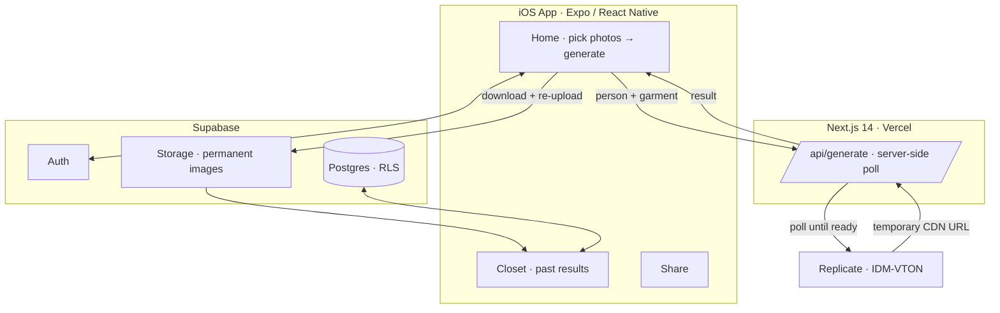

<div align="center">

# VTO — Virtual Try-On

### See how any garment looks on you before you buy it.

*Upload a photo of yourself and a photo of the clothing — an AI diffusion model composites them into a photorealistic result in seconds.*

<!-- Drop a banner/hero image at docs/assets/banner.png and it will render here -->


[](https://apps.apple.com/us/app/vto-virtual-try-on/id6769989598)


**Live on the App Store →** <https://apps.apple.com/us/app/vto-virtual-try-on/id6769989598>
**Web →** <https://virtual-try-on-three-sage.vercel.app>

</div>

---

## What VTO is

VTO is a mobile app that lets you try clothes on **before** buying them. You give it a
photo of yourself and a photo of a garment; a **diffusion-based virtual try-on model**
(IDM-VTON, via Replicate) composites them into a photorealistic image of you wearing it,
in roughly **5–15 seconds**. Results land in your **Closet** and can be shared.

Built end-to-end as a final-year project — backend, mobile, AI pipeline, and App Store
submission — and **live on the App Store** after passing App Review. No shortcuts.

---

## The one idea that makes it durable: own your pixels

The naive version of this app stores the URL the AI model hands back and calls it done.
That app breaks the next morning. **Replicate's CDN URLs expire after ~1 hour** — store
one in your database and every image in the user's closet goes blank by tomorrow.

VTO's pipeline **re-hosts every result the moment it's generated**: the app downloads the
fresh image and re-uploads it to **its own Supabase Storage**, so the database only ever
holds a permanent URL it controls. The generated image is shown immediately while the
permanent copy is saved in the background — fast *and* durable.

```
person photo  +  garment image
          │
          ▼
   Next.js API route  ──►  Replicate · IDM-VTON
   (server-side poll)      (diffusion virtual try-on)
          │
          ▼
   generated image  (~5–15 s)
          │
          ├── shown immediately in the app
          └── downloaded → re-uploaded to Supabase Storage
                 permanent URL → Closet · Share
```

---

## Architecture in one glance



The diffusion call runs **server-side** in a Next.js API route so the Replicate token
never ships in the app. The mobile client polls until the result is ready.

---

## Repository layout

```
/                           # Next.js web app (Vercel)
  src/app/
    page.tsx                # landing page
    api/generate/route.ts   # Replicate polling endpoint (server-side)
    privacy/page.tsx        # privacy policy
  .env.example

ai-vto-mobile/              # Expo / React Native app (iOS)
  app/
    auth.tsx                # sign in / sign up
    (tabs)/
      home.tsx              # try-on: pick photos → generate → save
      analysis.tsx          # fit analysis
      history.tsx           # closet — past generations grid
      stylist.tsx           # AI stylist chat
      share.tsx             # share a look
  src/lib/
    supabase.ts             # client + session
    storage.ts              # native binary upload to Supabase Storage
    savedPhotos.ts          # camera-roll helpers
    savedGarments.ts        # local garment persistence
  .env.example
```

---

## What VTO does today

| Capability | State | Notes |
|---|---|---|
| Virtual try-on | Done | IDM-VTON diffusion, ~5–15 s per generation. |
| Server-side generation | Done | Next.js API route; Replicate token stays server-side. |
| Permanent result storage | Done | Re-upload to Supabase so closets never go blank. |
| Closet | Done | Grid of past generations, persisted. |
| Native binary upload | Done | `FileSystem.uploadAsync` — no broken RN blobs. |
| Auth & RLS | Done | Supabase Auth + Row Level Security. |
| Share a look | Done | Share generated results. |
| App Store release | Done | Live, passed App Review. |

---

## Stack

| Layer | Technology |
|---|---|
| Mobile | Expo SDK 54 · React Native 0.81 · Expo Router (file-based) |
| Web | Next.js 14, deployed on Vercel |
| Backend | Supabase — Postgres, Auth, Storage (RLS) |
| AI model | Replicate — IDM-VTON |
| Build & submit | EAS Build + EAS Submit |

---

## Run locally

**Web**
```bash
npm install
cp .env.example .env.local
npm run dev
```

**Mobile**
```bash
cd ai-vto-mobile
npm install
cp .env.example .env
npx expo start
```

Environment variables:

```
# web
REPLICATE_API_TOKEN=
NEXT_PUBLIC_SUPABASE_URL=
NEXT_PUBLIC_SUPABASE_ANON_KEY=

# mobile
EXPO_PUBLIC_SUPABASE_URL=
EXPO_PUBLIC_SUPABASE_ANON_KEY=
EXPO_PUBLIC_BACKEND_URL=        # deployed Next.js URL
```

### Build & deploy

```bash
# web — push to main, Vercel auto-deploys

# iOS
eas build  --platform ios --profile production
eas submit --platform ios
```

---

## Two things I learned the hard way

**1. `fetch().blob()` is broken on React Native.**
Fetch a remote URL and call `.blob()` and React Native silently hands back an *empty*
blob. The upload to Supabase succeeds, the DB row is written — but the stored file is
zero bytes. Hours of blaming Supabase before realizing the blob was empty all along. Fix:
`FileSystem.downloadAsync` to a local cache file, then `FileSystem.uploadAsync` with
`BINARY_CONTENT` to send it natively, no JS serialization.

**2. Replicate CDN URLs expire.**
Generated images are served from a Replicate CDN with roughly a one-hour TTL. Store that
URL in your database and your entire history is broken by the next day. The fix is an
immediate re-upload to your own storage — Supabase here — so the DB always holds a
permanent URL. Not obvious until your closet tab goes blank.
