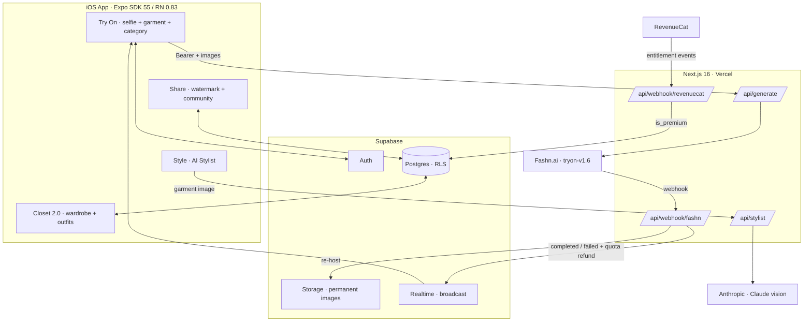

<div align="center">

# VTO — Virtual Try-On

### See how any garment looks on you before you buy it.

*Snap a selfie and pick a clothing item — an AI try-on model composites them into a photorealistic result in seconds, and an AI stylist tells you how to wear it.*

<!-- Drop a banner/hero image at docs/assets/banner.png and it will render here -->


[](https://apps.apple.com/us/app/vto-virtual-try-on/id6769989598)


**Live on the App Store →** <https://apps.apple.com/us/app/vto-virtual-try-on/id6769989598>
**Web →** <https://virtual-try-on-three-sage.vercel.app>

</div>

---

## What VTO is

VTO is an iOS app that lets you try clothes on **before** buying them. You take a selfie
and pick a garment photo (or paste a product URL); the **Fashn.ai `tryon-v1.6`** virtual
try-on model composites them into a photorealistic image of you wearing it in roughly
**10–20 seconds**. A **Claude-powered AI Stylist** analyzes any garment and suggests three
ways to wear it. Results land in your **Closet**, can be watermark-shared, and posted to
an in-app **Community** feed.

Built end-to-end solo — backend, mobile, AI pipeline, monetization, and App Store
submission — and **live on the App Store** after passing App Review.

---

## The one idea that makes it durable: own your pixels

The naive version of this app stores the URL the AI model hands back and calls it done.
That app breaks the next morning: **AI-provider CDN URLs expire**. VTO's pipeline
**re-hosts every result the moment it's generated** — the webhook (or the polling
fallback, whichever wins the atomic claim) downloads the fresh image and re-uploads it to
**its own Supabase Storage**, so the database only ever holds a permanent URL it controls.

```
selfie  +  garment (photo or product URL)  +  category  +  quality mode
          │
          ▼
   Next.js API route ──► Fashn.ai · tryon-v1.6
   (auth + daily quota)        │
          ┌────────────────────┤
          ▼                    ▼
   Supabase Realtime      webhook / polling  (atomic delete-claim — no double work)
   broadcast to the app        │
          ▼                    ▼
   result on screen      re-uploaded to Supabase Storage (permanent URL)
                               │
                               ▼
                    Closet · Share · Community
```

---

## Architecture in one glance


```mermaid
flowchart TB
    subgraph APP[iOS App · Expo SDK 55 / RN 0.83]
        H[Try On · selfie + garment + category]
        ST2[Style · AI Stylist]
        C[Closet 2.0 · wardrobe + outfits]
        SH[Share · watermark + community]
    end
    subgraph WEB[Next.js 16 · Vercel]
        GEN[/api/generate/]
        STY[/api/stylist/]
        RCW[/api/webhook/revenuecat/]
        FW[/api/webhook/fashn/]
    end
    FASHN[Fashn.ai · tryon-v1.6]
    CLAUDE[Anthropic · Claude vision]
    RC[RevenueCat]
    subgraph SB[Supabase]
        AUTH[Auth]
        DB[(Postgres · RLS)]
        STG[Storage · permanent images]
        RT[Realtime · broadcast]
    end
    H -->|Bearer + images| GEN --> FASHN
    FASHN -->|webhook| FW -->|re-host| STG
    FW -->|completed / failed + quota refund| RT --> H
    ST2 -->|garment image| STY --> CLAUDE
    RC -->|entitlement events| RCW -->|is_premium| DB
    H <--> AUTH
    DB <--> C
    SH <--> DB
```

Every AI call runs **server-side** so no API key ever ships in the app. Results arrive by
Supabase Realtime broadcast with a 10-second polling fallback; both paths race for an
atomic claim on the pending row, so exactly one of them persists the image.

---

## Repository layout

```
/                              # Next.js 16 backend + marketing site (Vercel)
  src/app/
    page.tsx                   # dark landing page (App Store support URL)
    support/ · terms/ · privacy/
    api/
      generate/route.ts        # auth + quota + Fashn.ai kickoff (category, quality mode)
      predictions/[id]/route.ts# polling fallback with atomic claim
      stylist/route.ts         # Claude vision — garment analysis + 3 suggestions
      report/route.ts          # real content-report intake (UGC compliance)
      scrape/route.ts          # authed, SSRF-hardened product-URL scraper
      webhook/fashn/route.ts   # fail-closed secret, re-host, quota refund on failure
      webhook/revenuecat/route.ts # server-side entitlement sync (is_premium)
      cron/cleanup/route.ts    # daily pending_generations TTL sweep
  supabase_schema.sql · supabase_freemium.sql · supabase_v1_1.sql
  vercel.json                  # cron schedule

ai-vto-mobile/                 # Expo / React Native app (iOS, dark-only)
  app/
    onboarding.tsx             # first-launch 3-slide intro + demo garment
    auth.tsx
    (tabs)/
      home.tsx                 # try-on flow: selfie → garment → category → generate
      stylist.tsx              # real AI stylist (Claude-backed)
      analysis.tsx             # fit analysis — measurements + size chart
      history.tsx              # Closet 2.0 — categories, outfits, daily reminder
      share.tsx                # watermark share + community feed
      profile.tsx              # subscription status, account, deletion
  src/lib/
    analytics.ts               # event tracking → Supabase events table
    sentry.ts                  # DSN-gated crash reporting
    premium.ts · notifications.ts · outfits.ts
    savedPhotos.ts · savedGarments.ts   # per-user scoped local persistence
```

---

## What VTO does today (v1.1)

| Capability | State | Notes |
|---|---|---|
| Virtual try-on | Done | Fashn.ai tryon-v1.6, ~10–20 s, webhook + Realtime + polling fallback. |
| Garment categories | Done | Tops / bottoms / full-body — correct model params per garment type. |
| Quality mode | Done | Premium-gated `quality` mode, server-enforced. |
| Try-on from URL | Done | Paste a product link — authed, SSRF-hardened scraper pulls the garment. |
| AI Stylist | Done | Claude vision analyzes the garment, returns 3 personalized outfit ideas. |
| Fit Analysis | Done | Measurements (chest/waist/hips) + size chart, no fake timers. |
| Closet 2.0 | Done | Categorized wardrobe, outfit builder, daily outfit reminder. |
| Community | Done | Post looks, likes (RPC, optimistic), views, weekly style challenge. |
| Watermark share | Done | Branded share card captured on-device. |
| Freemium | Done | 5 free generations/day, quota refunded on AI failure. |
| Server-side entitlements | Done | RevenueCat webhook owns `is_premium` — no client writes. |
| Content reporting | Done | Real `reports` intake, rate-limited (UGC / Guideline 1.2). |
| Observability | Done | Sentry (DSN-gated) + product analytics events table. |
| Privacy compliance | Done | Honest permission strings, full `PrivacyInfo.xcprivacy` data types. |
| Onboarding | Done | 3-slide intro + bundled demo garment for a first-run wow. |
| App Store release | Live | v1.0 approved; v1.1 package ready for submission. |

---

## Stack

| Layer | Technology |
|---|---|
| Mobile | Expo SDK 55 · React Native 0.83 · React 19.2 · Expo Router |
| Web/API | Next.js 16 (App Router), deployed on Vercel |
| Data | Supabase — Postgres (RLS), Auth, Storage, Realtime |
| AI try-on | Fashn.ai — tryon-v1.6 |
| AI stylist | Anthropic Claude (vision, structured output) |
| Payments | RevenueCat + App Store subscriptions (server-side webhook sync) |
| Crash/analytics | Sentry · first-party events table |
| Build & submit | EAS Build + EAS Submit |

---

## Run locally

**Web**
```bash
npm install
cp .env.example .env.local   # fill in keys — see the file for every variable
npm run dev
```

**Mobile**
```bash
cd ai-vto-mobile
npm install
npx expo start
```

Mobile env (EAS production profile already carries these):

```
EXPO_PUBLIC_SUPABASE_URL=
EXPO_PUBLIC_SUPABASE_ANON_KEY=
EXPO_PUBLIC_BACKEND_URL=        # deployed Next.js URL
EXPO_PUBLIC_REVENUECAT_IOS_KEY=
EXPO_PUBLIC_SENTRY_DSN=         # optional — Sentry is a no-op without it
```

Database: run `supabase_schema.sql`, `supabase_freemium.sql`, then `supabase_v1_1.sql`
in the Supabase SQL editor (all idempotent).

### Build & deploy

```bash
# web — push to main, Vercel auto-deploys

# iOS
cd ai-vto-mobile
eas build  --platform ios --profile production
eas submit --platform ios
```

---

## Three things learned the hard way

**1. `fetch().blob()` is broken on React Native.**
Fetch a remote URL and call `.blob()` and React Native silently hands back an *empty*
blob. The upload succeeds, the DB row is written — but the stored file is zero bytes.
Fix: download to a local cache file, then upload natively as binary content.

**2. AI-provider CDN URLs expire.**
Store the model's output URL in your database and your entire history is broken by the
next day. The fix is an immediate re-upload to your own storage so the DB always holds a
permanent URL. Not obvious until your closet tab goes blank.

**3. Webhooks and polling race — make persistence atomic.**
With both a webhook and a polling fallback able to persist the same result, you get
duplicates or, worse, cross-user mismatches. VTO resolves it with an atomic
delete-claim on the pending row: exactly one path wins, and results are looked up by
`prediction_id`, never by "latest generation".
